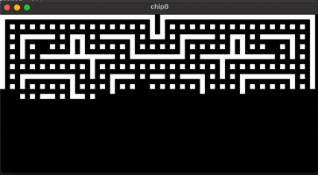

# Zig 8

## Why?
This project is the stepping stone to the next emulator for the original gameboy.
First learn about opcode and cpu loop and simple screen before tackling the full gameboy.

## Setup and build

1. Get zig compiler version 0.14.1 from [here](https://ziglang.org/download/). "Installation" (it's just a binary, awesome) guide can be found [here](https://zig.guide/getting-started/installation).
2. `zig build run -- "rom/blinky.ch8"` (or some other rom in that dir, or just download new)

That's it
